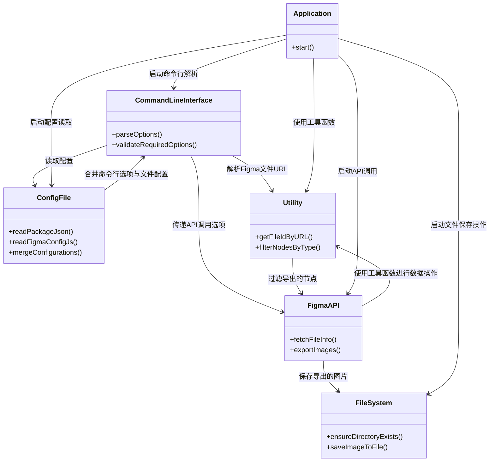
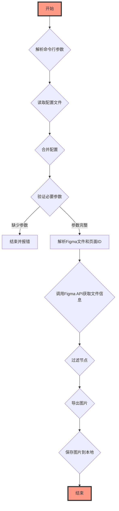

这个Mermaid图展示了Figma图片下载工具的主要组件和它们之间的关系。以下是各组件的简要说明：

- CommandLineInterface：负责解析命令行参数，验证必要的选项。
- ConfigFile：从package.json和figma.config.js读取配置，合并配置项。
- FigmaAPI：调用Figma API获取文件信息和导出图片。
- FileSystem：确保目录存在，将导出的图片保存到文件。
- Utility：提供辅助功能，如通过URL解析文件ID，根据类型过滤节点。
- Application：应用程序的入口点，负责启动和协调上述组件的交互。

这个设计图全面展现了工具的设计思路，包括组件的职责和它们之间的交互方式，有助于理解整个应用程序的工作流程和架构设计。

这个Mermaid流程图展示了Figma图片下载工具的工作流程，从开始到结束，每一步骤都清晰地标识了其功能和作用，以及它们之间的逻辑关系。流程图比类图更直观地展示了程序的执行流程，有助于理解整个应用程序的操作逻辑和步骤顺序。